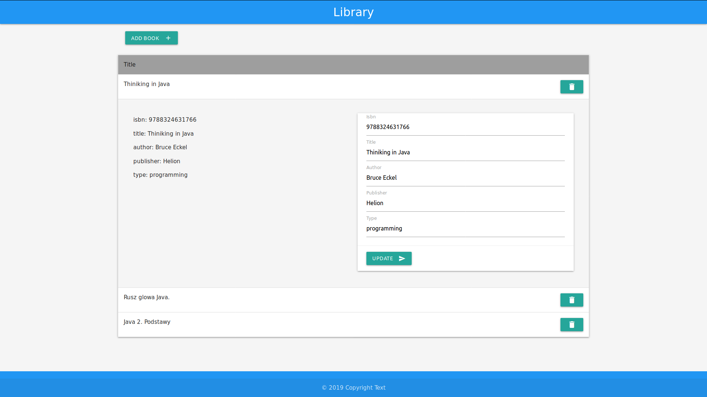

# Library

REST klient do zarządzania książkami który komunikuje się z serwerem przy pomocy żądań Ajax.

## Funkcionalność
* Dodawania nowych książek
* Usuwanie książek
* Edytowanie książek
* Wyświetlanie książek oraz ich szczegół

## Start
1. Pobrać project `git clone https://github.com/yarikwest/Library-rest-client.git`
2. Odpalić REST server w konsoli `java -jar rest-api/rest-api-1.0-SNAPSHOT-manual.jar`
3. Otworzyć plik **index.html** w przeglądarce

## Technologję
* [HTML, CSS, JS]()
* [jQuery](https://jquery.com)
* [MaterializeCSS](https://materializecss.com/)
